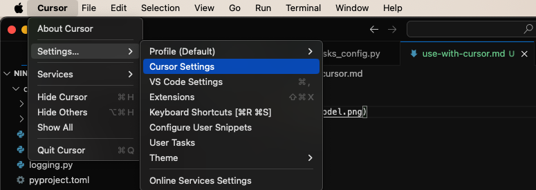
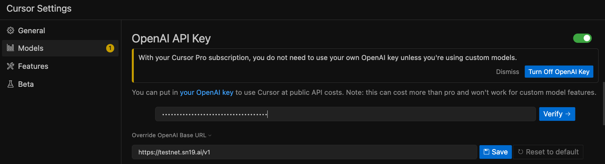

# Guide to use SN18 with Cursor

### **Open settings**

Follow these steps on a mac:

### **Add a new model, named exactly `gpt-4o`**

It's very important the name matches exactly. If there is already existing one, then just use it.

### **Configure custom 'OPENAI' endpoint**

First, disable all other OpenAI models. Don't worry, they're degraded to hell anyway

Use:

Endpoint: `https://{server_base_url}/v1` 

# Done

Enjoy :)
